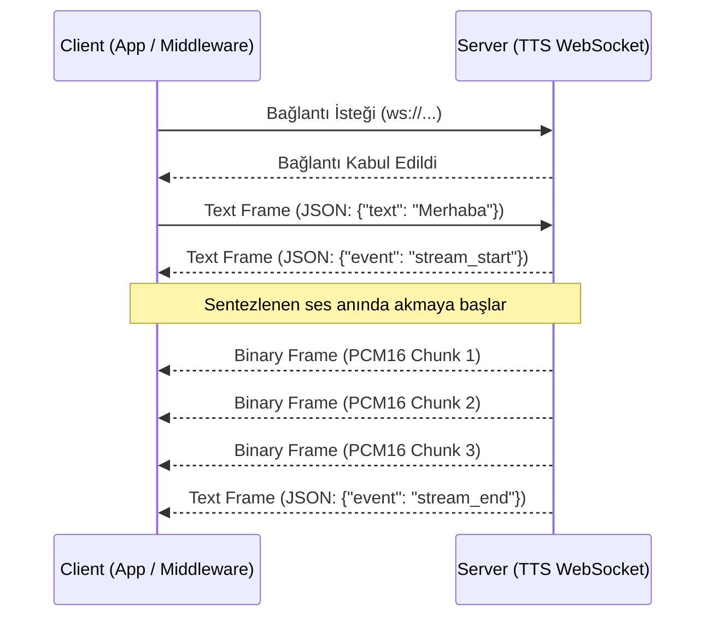

# Trendyol TTS & VoxCPM Entegrasyon ve Geliştirici Kılavuzu (Developer Guide)

Bu belge, oluşturulan TTS (Metinden Sese) akışkan (streaming) altyapısının dış sistemler (Backend, .NET Middleware, Java, iOS, Android) tarafından nasıl çağrılacağını, veri çıktı formatlarını ve hata yönetimi prosedürlerini içerir.

## 1. Bağlantı ve İletişim Protokolü

Sistem, **Multiplexed WebSocket** protokolü üzerinden iletişim kurar. Bu protokol sayesinde kontrol olayları (metadata/error) ile ağır ses verisi (binary audio) birbirinden ayrılmıştır.



* **WebSocket URI:** `ws://<sunucu_ip>:8000/ws/tts`
* **Bağlantı Tipi:** Çift Yönlü (Bidirectional) Asenkron WebSocket

## 2. Sistemi Çağırma (İstek Yapma)

İstemci (Client), WebSocket bağlantısını kurduktan sonra sentezlenmesini istediği metni bir `JSON` metin çerçevesi (Text Frame) olarak göndererek akışı başlatır:

**Örnek İstek (Text Frame):**
```json
{
  "text": "Merhaba, bu gelişmiş sistem çoklu cihaz desteklidir."
}
```

## 3. Çıktı Formatları ve Olay Yönetimi

Sistem çağrıldıktan sonra, istemciye iki farklı formatta çerçeve (frame) gönderilir. İstemcinin (Middleware'in) bu iki frame türünü ayıklaması (parse) gerekir.

### A. Metin Çerçeveleri (Text Frames - JSON)
Sistemin durumunu, metadata bilgisini veya oluşan hataları bildirir.

**1. Akış Başlangıcı (`stream_start`):**
Bağlantı kurulup metin alındığında, sesin hangi formatta ve hangi motordan (GPU/CPU) geleceğini bildirir.
```json
{
  "event": "stream_start",
  "engine": "VoxCPM-Pool", // veya "Piper-Fallback"
  "format": "pcm16_le",
  "sample_rate": 24000
}
```

**2. Cümle Tamamlanması (`sentence_complete`):**
Uzun metinler parça parça işlenirken, hangi cümlenin sesinin gönderiminin bittiğini bildirir. Animasyon senkronizasyonu (dudak oynatma vb.) için kullanılır.
```json
{
  "event": "sentence_complete",
  "sentence_index": 0
}
```

**3. Akış Bitişi (`stream_end`):**
Tüm ses başarıyla gönderildikten sonra atılır ve sunucu WebSocket bağlantısını (`1000 Normal Closure`) kapatır.
```json
{
  "event": "stream_end"
}
```

**4. Hata Durumu (`error`):**
Herhangi bir yazılımsal veya donanımsal hata (çökme) yaşandığında iletilir.
```json
{
  "event": "error",
  "error_type": "ValueError",
  "message": "Geçersiz giriş formatı."
}
```

### B. İkili Çerçeveler (Binary Frames - Raw Bytes)
Ses paketleri kayıpsız, başlık bilgisi içermeyen saf (raw) byte dizileri olarak gönderilir.
* **Format:** `PCM16` (16-bit Signed Integer)
* **Byte Sıralaması:** `Little-Endian (LE)` (Donanım okuma seviyesi uyumluluğu için - ekstra CPU döngüsü harcatmaz).
* İstemci cihazlar (Örn: Android `AudioTrack`, iOS `AVAudioEngine` veya C# byte tamponları) bu veriyi aldığı gibi hoparlör arabelleğine yazabilir.

---

## 4. .NET ve Java Middleware Entegrasyon Örnekleri

Hataları yakalayıp JSON'ı parse etmek ve Binary veriyi ayırmak için Middleware katmanlarında aşağıdaki gibi bir yapı kullanılmalıdır.

### .NET (C#) Middleware Örneği
```csharp
using System.Net.WebSockets;
using System.Text.Json;
using System.Text;

var ws = new ClientWebSocket();
await ws.ConnectAsync(new Uri("ws://127.0.0.1:8000/ws/tts"), CancellationToken.None);

// İsteği Gönder
var requestJson = JsonSerializer.Serialize(new { text = "Merhaba .NET dünyası!" });
await ws.SendAsync(Encoding.UTF8.GetBytes(requestJson), WebSocketMessageType.Text, true, CancellationToken.None);

// Yanıtları Dinle
var buffer = new byte[8192];
while (ws.State == WebSocketState.Open)
{
    var result = await ws.ReceiveAsync(new ArraySegment<byte>(buffer), CancellationToken.None);
    
    // TEXT FRAME (Kontrol Mesajları ve Hatalar)
    if (result.MessageType == WebSocketMessageType.Text)
    {
        var jsonResponse = Encoding.UTF8.GetString(buffer, 0, result.Count);
        var jsonDoc = JsonDocument.Parse(jsonResponse);
        
        var eventType = jsonDoc.RootElement.GetProperty("event").GetString();
        if (eventType == "error")
        {
            var errType = jsonDoc.RootElement.GetProperty("error_type").GetString();
            var errMsg = jsonDoc.RootElement.GetProperty("message").GetString();
            // NLog veya Serilog ile logla
            _logger.LogError("TTS Hatası [{ErrorType}]: {ErrorMessage}", errType, errMsg);
        }
    }
    // BINARY FRAME (Saf Ses Verisi - PCM16 LE)
    else if (result.MessageType == WebSocketMessageType.Binary)
    {
        var pcmData = buffer.Take(result.Count).ToArray();
        // Sesi işleme katmanına ilet
        ProcessRawAudioStream(pcmData);
    }
}
```

### Java (Spring / OkHttp) Middleware Örneği
```java
import okhttp3.*;
import org.json.JSONObject;

OkHttpClient client = new OkHttpClient();
Request request = new Request.Builder().url("ws://127.0.0.1:8000/ws/tts").build();

WebSocketListener webSocketListener = new WebSocketListener() {
    @Override
    public void onOpen(WebSocket webSocket, Response response) {
        webSocket.send("{\"text\": \"Merhaba Java dünyası!\"}");
    }

    @Override
    public void onMessage(WebSocket webSocket, String text) {
        // Text Frame: JSON Olayları
        try {
            JSONObject json = new JSONObject(text);
            if (json.getString("event").equals("error")) {
                String type = json.getString("error_type");
                String msg = json.getString("message");
                // SLF4J / Logback ile loglama
                logger.error("TTS Motor Hatası [{}]: {}", type, msg);
            }
        } catch (Exception e) {
            e.printStackTrace();
        }
    }

    @Override
    public void onMessage(WebSocket webSocket, ByteString bytes) {
        // Binary Frame: Ses Akışı (PCM16 LE)
        byte[] pcmData = bytes.toByteArray();
        // İstemci soketine yönlendir
        audioOutputStream.write(pcmData);
    }
};

client.newWebSocket(request, webSocketListener);
```

---

## 5. Canlı LLM (Büyük Dil Modeli) Akış Entegrasyonu (OpenAI, Gemini vb.)

Eğer metin statik değilse ve bir yapay zeka modelinden (örneğin OpenAI GPT-4, Llama veya Gemini) kelime kelime (token-by-token) akıyorsa, bu akışı kesintisiz bir sese dönüştürmek için Middleware tarafında **"Cümle Sınırı Tamponlama (Sentence-Boundary Buffering)"** stratejisi uygulanmalıdır.

### Mimari Akış:
1. **Dinleme:** Middleware (C# / Java), LLM'in sunduğu Server-Sent Events (SSE) akışına (stream) bağlanır.
2. **Biriktirme:** Gelen her token (kelime/hece) geçici bir bellekte (String Builder) biriktirilir.
3. **Fırlatma:** `.`, `?`, `!`, `\n` gibi cümle sonu belirteçlerinden birine rastlandığı anda biriktirilen bu tam cümle TTS WebSocket'ine `{ "text": "tam cümle." }` payload'u ile gönderilir. Tampon (buffer) sıfırlanır.
4. **Eşzamanlılık:** TTS sunucusu bu cümleyi anında sese çevirip Binary Frame olarak geri dönerken, Middleware arka planda LLM'den gelen sonraki cümleyi biriktirmeye devam eder. Bu sayede ilk sese varış süresi (TTFA) olağanüstü düşer.

### .NET (C#) ile OpenAI ve TTS Köprüsü Örneği

Aşağıdaki örnek, OpenAI akışından gelen yanıtları anlık olarak yakalayıp doğrudan TTS motorumuza ileten örnek bir köprü fonksiyonudur:

```csharp
using System.Net.WebSockets;
using System.Text;
using System.Text.Json;
// Not: Projenizde kullandığınız OpenAI veya LLM SDK'sına göre uyarlayınız.

public async Task StreamLlmToTts(IAsyncEnumerable<string> llmTokenStream, ClientWebSocket ttsSocket)
{
    StringBuilder sentenceBuffer = new StringBuilder();
    // Cümleyi böleceğimiz noktalama işaretleri
    char[] delimiters = { '.', '?', '!', '\n' };

    // LLM'den gelen her bir kelimeyi (token) dinliyoruz
    await foreach (var token in llmTokenStream)
    {
        sentenceBuffer.Append(token);

        // Eğer gelen token bir cümle bitirici işaret içeriyorsa
        if (token.IndexOfAny(delimiters) >= 0)
        {
            string completeSentence = sentenceBuffer.ToString().Trim();
            if (completeSentence.Length > 2)
            {
                // Yakalanan tam cümleyi TTS Sunucusuna fırlat
                var request = JsonSerializer.Serialize(new { text = completeSentence });
                await ttsSocket.SendAsync(
                    Encoding.UTF8.GetBytes(request), 
                    WebSocketMessageType.Text, 
                    true, 
                    CancellationToken.None
                );
            }
            
            // Sonraki cümle için tamponu sıfırla
            sentenceBuffer.Clear();
        }
    }
    
    // LLM akışı tamamen bittiğinde, noktalamasız arta kalan son kelimeler varsa onları da yolla
    if (sentenceBuffer.Length > 0)
    {
        var finalRequest = JsonSerializer.Serialize(new { text = sentenceBuffer.ToString().Trim() });
        await ttsSocket.SendAsync(
            Encoding.UTF8.GetBytes(finalRequest), 
            WebSocketMessageType.Text, 
            true, 
            CancellationToken.None
        );
    }
}
```

### Bu Yöntemin Avantajları:
- **Kekemelik (Stuttering) Engellenir:** LLM'ler internet bağlantısına veya sunucu yoğunluğuna göre kelimeleri düzensiz hızlarda atabilir. Kelime kelime TTS'e göndermek robotik ve kesintili bir ses yaratır. Cümle bazlı göndermek, TTS'in ses entonasyonunu (vurguları) mükemmel ayarlamasını sağlar.
- **Kusursuz Paralellik:** İlk cümle TTS'te işlenip sese dönüşürken (ve kullanıcı hoparlörden ilk sesi duyarken), LLM çoktan ikinci ve üçüncü cümleyi Middleware'e basmış olur. İstemci kesinlikle bekletilmez.
