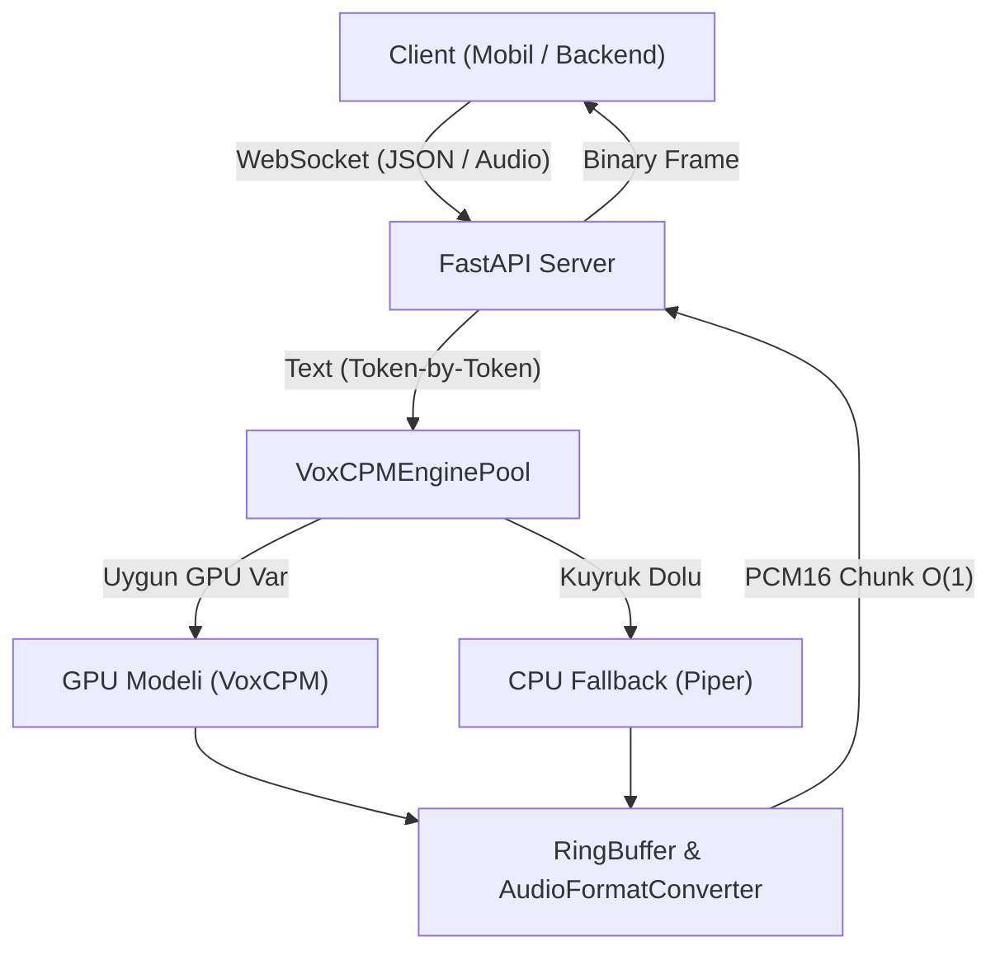

# VoxCPM & Trendyol TTS Akışkan Çıkarım (Streaming) Sistem Mimarisi ve Raporu

Bu doküman, VoxCPM ve Trendyol TTS modelleri temel alınarak geliştirilen, düşük gecikmeli (low-latency) ve yüksek verimli (high-throughput) ses sentezleme sisteminin mimari kararlarını, optimizasyon yöntemlerini, cross-platform (.NET, Java, iOS, Android) entegrasyon stratejilerini ve gelecek vizyonunu kurumsal standartlarda özetlemektedir.

---

## 🌟 Neden Bu Sistem ? (Mimari Avantajlar)

Geleneksel TTS entegrasyonları, tüm metnin sentezlenmesini bekleyip tek bir `.wav` dosyası dönen monolitik ve bloklayıcı bir yapıya sahiptir. Geliştirdiğimiz bu yeni sistem, kurumsal FinTech altyapılarında kullanılan asenkron mesajlaşma ve kaynak havuzu desenleriyle tasarlanmıştır:

1. **Time-To-First-Audio (TTFA) Minimizasyonu:** Sistem, metnin tamamının sentezlenmesini beklemeden ilk anlamlı cümlenin sesini üretir üretmez istemciye (client) akıtmaya başlar. Bu, kullanıcı tarafındaki algılanan bekleme süresini (perceived latency) neredeyse sıfıra indirir.
2. **Kritik Eşzamanlılık (High Concurrency):** FastAPI Event Loop'unu engelleyen (blocking) ağır yapay zeka çıkarım işlemleri, özel arka plan iş parçacığı havuzlarına (Worker Thread Pool) devredilmiştir. Bu sayede sunucu, tek bir çıkarım işlemi sırasında diğer istemcilerden gelen ağ isteklerini kabul etmeye devam edebilir.
3. **Maksimum Donanım Verimliliği:** Sabit bellek adresleme (pre-allocation) teknikleri sayesinde Python'ın en büyük zayıflıklarından biri olan Garbage Collection (GC) duraklamaları ve bellek parçalanması (fragmentation) engellenmiştir.
4. **Hatasız Birlikte Çalışabilirlik (Interoperability):** Protokol seviyesinde veri ve kontrol mesajları birbirinden ayrılmıştır. .NET Middleware, Java sunucuları veya yerel (native) Android/iOS mobil uygulamaları karmaşık veri dönüştürme adımları olmadan sistemi tüketebilir.

---

## 🛠️ Neleri Nasıl Geliştirdik? (Teknik Detaylar ve Optimizasyonlar)

Sistem geliştirilirken OOP (Nesne Yönelimli Programlama) ve SOLID prensipleri temel alınmış, algoritmik seviyede optimizasyonlar uygulanmıştır:

### 1. Bellek ve Döngü Optimizasyonları (O(1) & O(N))
* **RingBuffer (Dairesel Tampon):** `streaming.py` içerisinde yer alan `RingBuffer`, çalışma zamanında dinamik olarak genişlemeyen, başlangıçta boyutu sabitlenmiş dairesel dizi yapısına sahiptir. Yazma ve okuma işaretçilerinin (head/tail) kaydırılmasıyla çalışır ve **$O(1)$** zaman karmaşıklığında bellek erişimi sunar.
* **Vektörize Format Dönüşümü:** `AudioFormatConverter`, Python seviyesinde yavaş çalışan `for` döngülerinden tamamen arındırılmıştır. NumPy kütüphanesinin C tabanlı SIMD (Single Instruction, Multiple Data) yönergelerini kullanan vektörize operasyonlarıyla, ses genlik sınırlama (clipping) ve `PCM16 Little-Endian` dönüşümlerini anlık (**$O(N)$** ama donanım hızında) gerçekleştirir.
* **TextBuffer:** LLM (büyük dil modelleri) tarafından parça parça (token) üretilen metin akışı, yavaş string ekleme işlemleriyle değil, listeler üzerinde **$O(1)$** ekleme mantığıyla toplanır. Sadece cümle sınırlarına gelindiğinde tek seferde birleştirilerek (**$O(N)$**) önceden derlenmiş regex motoruna sunulur.

### 2. Çoklu GPU Havuzu (Resource Pooling)
* 5 GPU'yu yatay ölçekte yönetebilmek için **Object Pool Pattern** uygulanmıştır (`VoxCPMEnginePool`).
* GPU modellerinin yük durumları ve kilitleri asenkron bir `asyncio.Queue` yapısı üzerinden **$O(1)$** karmaşıklığında yönetilir.
* Kaynak havuzu sayesinde hiçbir istek bir diğerinin sırasını kilitlemez; her istemci boştaki ilk GPU'ya atanır.

### 3. Dinamik Fallback (Yedeklilik ve Dayanıklılık)
* Eğer 5 GPU'nun tamamı yoğunsa ve istek sırası konfigürasyonda belirtilen eşik değerini (`piper_fallback_queue_threshold`) aşarsa, Dependency Injection mekanizması isteği otomatik olarak CPU üzerinde çalışan ultra hızlı **Piper** motoruna yönlendirir.
* Bu geçiş istemci tarafına hissettirilmeden şeffaf bir şekilde yapılır, servis kesintisi (denial of service) önlenir.

### 4. Kurumsal Protokol Seviyesi (Multiplexed WebSockets)
* Farklı platformların (.NET, Java, iOS, Android) aynı arayüzden beslenebilmesi için WebSocket akışı çoklanmıştır:
  * **Text Frame (JSON):** Bağlantı başlangıcı, hata yönetimi ve cümle sınırlarının bildirimi gibi kontrol olayları için kullanılır.
  * **Binary Frame (Raw Bytes):** Sadece saf, Little-Endian formatta `PCM16` byte dizilerini taşır. İstemci cihazlar bu binary paketleri aldıkları gibi doğrudan donanım ses kuyruğuna (Audio Buffer) yazabilirler.

---

## 🔮 Gelecekte Eklenebilecek Özellikler (Yol Haritası)

Sistem modüler ve gevşek bağlı (loosely coupled) bir yapıda kurulduğu için gelecekteki genişleme ihtiyaçlarına son derece açıktır:

### 1. Kümelenmiş ve Dağıtık Yapı (Distributed Orchestration)
* **Kubernetes Entegrasyonu:** GPU havuzunun tek bir makineyle sınırlı kalmaması için pod bazlı yatay ölçekleme (Horizontal Pod Autoscaling) altyapısına geçilebilir.
* **Redis Pub/Sub ile Durum Yönetimi:** İsteklerin ve GPU yüklerinin paylaşımlı bir Redis katmanı üzerinden dağıtılmasıyla sunucu bağımsız (stateless) bir küme mimarisi kurulabilir.

### 2. Akıllı Ses Önbellekleme (Semantic Audio Caching)
* Sıkça üretilen cümlelerin ses çıktıları, anlamsal benzerlik algoritmaları (vector embeddings) kullanılarak Redis veya yerel bir NoSQL veritabanında saklanabilir.
* Aynı veya çok benzer bir cümle talep edildiğinde AI motoruna gitmeden doğrudan önbellekten **$O(1)$** hızla ses döndürülebilir.

### 3. Alternatif Protokol Destekleri (gRPC & HTTP/2)
* Mevcut WebSocket katmanının yanına, özellikle .NET ve Java tabanlı backend servisleriyle daha performanslı ve düşük yükle (overhead) haberleşmek amacıyla **gRPC (Protocol Buffers)** protokol adaptörü eklenebilir.

### 4. Gelişmiş Güvenlik ve Yetkilendirme
* API ağ geçitleri (API Gateway) ile uyumlu çalışacak OAuth2/JWT doğrulama katmanları ve istemci bazlı hız limitleme (rate-limiting) politikaları doğrudan bağımlılık enjeksiyon sistemine entegre edilebilir.
